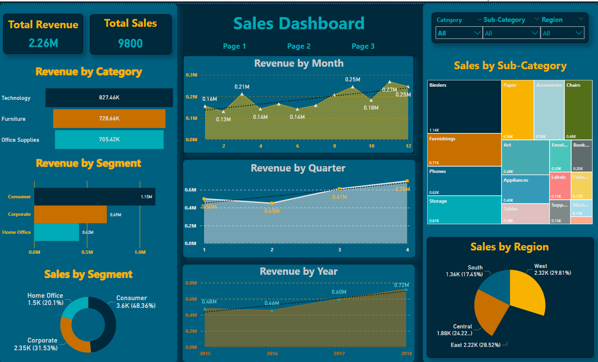

**Description:**
This project involves the creation of an interactive sales dashboard using the Superstore Sales Dataset. The dashboard provides comprehensive insights into the sales performance across different categories, segments, and regions. Key visualizations include revenue by month, quarter, and year, as well as detailed breakdowns by product category and sub-category. This enables users to analyze sales trends and identify key areas of growth and improvement.

**Skills:**
Data visualization, data analysis, business intelligence, dashboard design.

**Hard skills:**
Power BI, data visualization techniques, data transformation, DAX (Data Analysis Expressions).

**Results:**
Developed an intuitive and dynamic sales dashboard that offers valuable insights into sales performance. The dashboard allows stakeholders to make data-driven decisions by providing a clear overview of sales trends and segment performances, enhancing strategic planning and operational efficiency.

**Source:** Superstore Sales Dataset on [ Kaggle](https://www.kaggle.com/datasets/rohitsahoo/sales-forecasting)