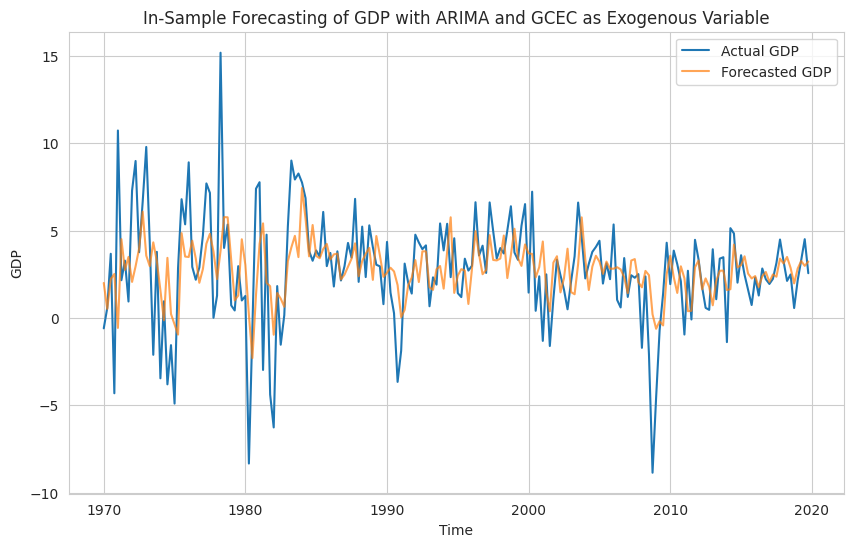

**Description:** This project focuses on predicting the US GDP growth rate using the ARIMA model, applying time series analysis to understand and forecast economic trends.

**Skills:** Time series forecasting, economic modeling, statistical analysis.

**Hard skills:** Python, ARIMA modeling, Pandas, statsmodels.

**Results:** Successfully developed a predictive model that forecasts US GDP growth rates, providing valuable insights for economic planning and strategy."

For more details, you can explore the original project on [Kaggle](https://www.kaggle.com/code/zahrasadjadi/forecasting-us-gdp-growth-rate-with-arima-model).
